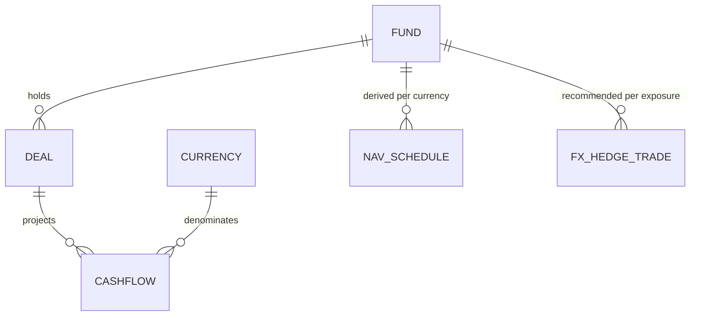
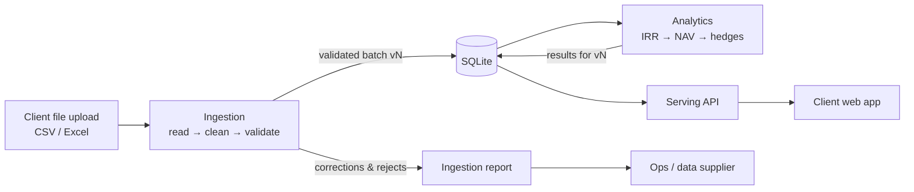

# Design Document

Parts 1, 2 and 4 of the case study. Part 3 is the code in `src/riskview/` with tests in `tests/`; the README covers approach and assumptions.

## Part 1 — Schema Design

This feature runs on three entities. The **cashflow** is the input — the record clients supply; the **NAV schedule** and the **FX hedge trade** are derived from it. Each is defined below as implemented — the Pydantic models in `schemas.py` — and the same shapes are the target tables once persistence is added. Fund, Deal and Currency are the structure these entities hang off; they are explained in the relationships section rather than modelled as tables today, with notes on what would change when they are.

### Cashflow

The input entity — the only one clients supply; everything else is derived from it.

| Field | Type | Notes |
|---|---|---|
| id | int | row id from the client file, kept for reconciliation |
| fund_name | str | owning fund (normalised to a `fund_id` FK at rest) |
| cashflow_date | date | calendar date, no time component |
| cashflow_type | enum | Investment, Interest, Principal Repayment |
| currency | ISO 4217 | local currency of the flow; validated against a closed set — this is what catches `GPB` |
| amount_local | decimal | outflows negative, inflows positive; enforced by validators |
| amount_base | decimal | client-supplied conversion to the fund's base currency |
| base_currency | ISO 4217 | the fund's reporting currency |

Amounts are exact decimals at rest; analytics use floats for root-finding and round results back to cents. The natural key is (fund, currency, date, type), enforced as a unique constraint within a projection version; a file carrying two rows for one key is rejected with a reason rather than silently keeping one of them.

### NAV schedule

Derived — one schedule per (fund, currency) in local-currency terms, plus one fund-level schedule in base currency. Never entered by hand, safe to rebuild at any time.

| Field | Type | Notes |
|---|---|---|
| fund_name | str | |
| currency | ISO 4217 | position currency (base currency for the fund-level schedule) |
| irr | float | the position's IRR, which is also the discount rate for every point |
| points | | one per cashflow date, each holding: |
| · date | date | |
| · nav | decimal | PV of flows on or after the date, at the IRR; by construction NAV(0) = 0 and NAV at the final date equals the terminal value — the schedule's built-in sanity checks |
| · open_exposure | decimal | PV of flows after the date — the amount a hedge must cover |

### FX hedge trade

Derived — one FX forward per quarterly roll per non-base-currency exposure.

| Field | Type | Notes |
|---|---|---|
| fund_name | str | |
| trade_date | date | a NAV schedule date |
| value_date | date | 3 months after the trade date — the next roll |
| sell_currency | ISO 4217 | the exposure currency |
| buy_currency | ISO 4217 | the fund's base currency |
| notional_sell | decimal | coverage_ratio × open exposure at the trade date |
| coverage_ratio | float | 1.0 — hedge the full exposure; a field rather than a constant, so partial cover is a data change, not a code change |

### How they relate to Fund, Deal and Currency



**Fund** is the reporting unit and owns the base currency. Cashflows carry their fund and its base currency; NAV schedules and hedge trades are computed per fund. At rest this is a `funds` table with a surrogate id, because names can change while references shouldn't; the id is assigned on first sight, in name order, and stays stable. A fund cannot change its reporting currency through an upload — that would silently restate every historical figure — so a file that disagrees with the stored base currency is rejected.

**Deal** sits between fund and cashflow, but the sample feed has no deal identifier, so a position here is a (fund, currency) pair and there is no deal model — a synthetic deal per position would add nothing. *Future note: when feeds carry deal ids, one additive migration adds a `deals` table and a nullable `cashflows.deal_id`. Old files keep loading, fund-level analytics are unchanged (they already aggregate per fund and currency), and deal-level IRR becomes a finer grouping of the same computation.*

**Currency** is a reference set of ISO 4217 codes that every currency field validates against — a closed enum in code (`CurrencyCode`) and a `currencies` reference table at rest, seeded by a migration, with a foreign key from every currency column. Today that set is exactly the three currencies the sample feed uses (EUR, GBP, USD), not the full ISO 4217 list; this is what turns a typo like `GPB` into a validation error instead of silent bad data, and supporting a new currency is one enum member plus one row in a migration.

### Schema evolution

Data lives in SQLite, and the rules below are enforced rather than intended:

- Every schema change is an Alembic migration, applied at deploy. The database is never edited by hand, and the application never calls `create_all` — migrations are the only way schema exists, so they run on every test and `tests/test_migrations.py` fails on any drift between them and the models.
- Changes are additive: new optional columns with defaults, never repurposing a column. Migrations run in batch mode, because SQLite implements `ALTER` as a table rebuild; that is also why the metadata carries a constraint naming convention from revision one.
- The Pydantic schemas are the contract; storage differs per backend. Amounts are exact text in SQLite and `NUMERIC` in PostgreSQL (`db/types.py`), which keeps `Decimal` lossless — SQLAlchemy's own `Numeric` round-trips through float on SQLite and would corrupt them. The cost is that amounts cannot be ordered or summed in SQL under SQLite; every aggregation happens in `riskview.analytics`.
- Currencies and cashflow types are reference tables seeded by a data migration, and every currency and type column is a foreign key into them. Reference data belongs in migrations because the schema is unusable without it; client data never does.
- Unknown cashflow types are rejected at ingestion until analytics handle them; silently ignoring one would produce a wrong NAV.
- **Shipped:** cashflows and everything derived from them carry a projection version, making each uploaded batch immutable and versioned. Part 4 relies on it. One departure from the pseudocode below: the version is per fund, not global, because a file containing one client's fund must leave every other fund's published projection alone.

## Part 2 — Pipeline Design



### Trigger mechanism and step dependencies

A file upload triggers ingestion; a validated batch makes analytics for the affected funds due; serving reads only stored results. Analytics are computed at ingestion, inside the same transaction as the batch, and serving reads them back from rows without ever running the analytics engine. Every step reads and writes stored artifacts, so the same steps can later run as queue workers without changing their logic.

### Where each piece of logic lives

| Layer | Package | Role |
|---|---|---|
| Ingestion | `riskview.ingestion` | CSV/Excel readers, cleaning, validation; the only place dirty data exists |
| Analytics | `riskview.analytics` | pure functions from cashflows to IRR, NAV and hedges; no I/O |
| Storage | `riskview.db` | ORM models, migrations, and the repository — the only place SQL exists |
| Serving | `riskview.api` | the ingest endpoint plus read-only views over stored results |

Shared shapes live in `riskview.schemas` and `riskview.main` wires everything together. Each layer depends only on the shapes, so any of them can be split out later.

### Dirty data handling

Fix only what is unambiguous, and record every fix: stray characters, known date formats, thousands separators, a short map of known currency typos (`GPB→GBP`). Anything else is rejected row by row with a reason; one bad row never blocks the batch, and the accepted/corrected/rejected report goes back to the data supplier. Date formats are a fixed whitelist because `03/04/2026` reads differently under day-first and month-first conventions — the convention comes from the source contract and is never guessed.

### Idempotency

Ingestion is a pure function of the file bytes, and the SHA-256 of those bytes is the batch's idempotency key: re-uploading a file already ingested is a no-op that returns the original report. A file that does land is written as a new immutable version rather than over the top of the last one, and analytics are deterministic. Re-running any step, or the whole pipeline, gives the same result, so retries are always safe.

### Pseudocode

```
on cashflow_file_uploaded(file):
    if batch := find_batch(sha256(file)): return report(batch)   # same bytes, already done
    result = ingest(file)                     # rows → clean → validate → {accepted, corrected, rejected}
    if result.rejects: notify(supplier, result.rejects)
    batch = record_batch(result, sha256(file))               # immutable audit row
    for fund in funds_in(result):                            # one transaction for the whole file
        version = new_version(fund, batch)                   # immutable projection version
        save_cashflows(version, result.cashflows_for(fund))
        save_analytics(version, compute(fund, ...))          # IRR → NAV → hedges, pure
        set_current(fund, version)            # atomic pointer swap; serving never sees partial state
    commit()                                  # any failure above leaves the last good state untouched
```

## Part 4 — Trade-offs

### Serving analytics and hedge recommendations to a client-facing web application

Compute on write, serve reads from stored results. Projections change a few times a quarter while clients read daily, so the API stays a stateless read layer over precomputed views and never runs analytics in-request. Results are immutable per projection version, so `ETag = version` gives cache invalidation for free. As volume grows, ingestion and analytics move behind a queue, and auth and per-fund tenancy sit at the gateway. I would not split into microservices or add streaming at this stage: module boundaries in one deployable give the same separation at far lower cost.

### Cashflow projections revised mid-quarter with hedges in-flight

Keep two ledgers. Projections are versioned and replaceable; executed hedges are facts and never change. A revision creates projection version N+1 and recomputes the target exposure per roll date. The engine compares that against the live hedge book and recommends adjustment trades — top up or partially unwind — rather than cancel-and-replace, which keeps transaction costs down and the audit trail clean. Each recommendation records the projection version it came from, and small deltas can wait for the next roll under a tolerance band.
