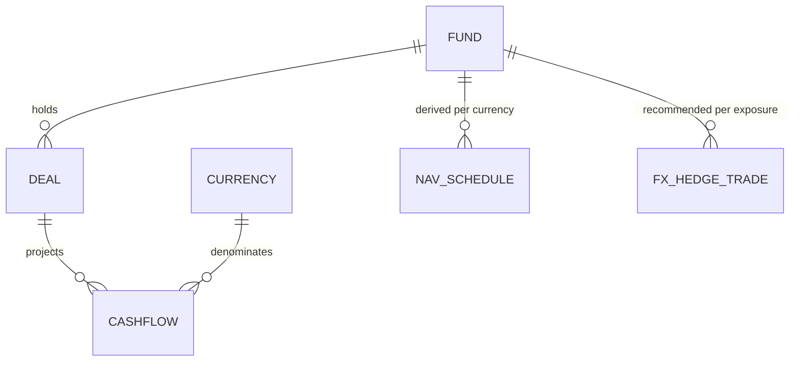
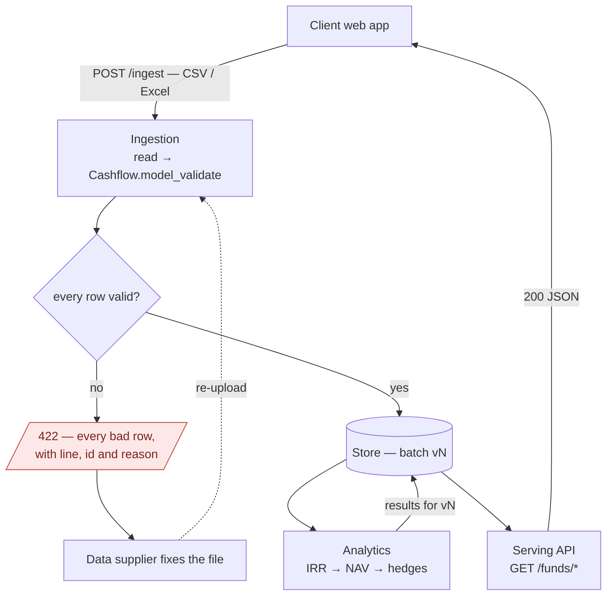

# Design Document

Parts 1, 2 and 4 of the case study. Part 3 is the code in `src/riskview/` with tests in `tests/`; the README covers approach and assumptions.

## Part 1 — Schema Design

This feature runs on three entities. The **cashflow** is the input — the record clients supply; the **NAV schedule** and the **FX hedge trade** are derived from it. Each is defined below as the Pydantic models in `schemas.py`; the tables they rest in are the SQLAlchemy models in `db/models.py`, where each version of a fund's projection carries its own cashflows, NAV schedules and hedge trades. Fund, Deal and Currency are the structure these entities hang off and are explained in the relationships section.

### Cashflow

The input entity — the only one clients supply; everything else is derived from it.

| Field | Type | Notes |
|---|---|---|
| id | int | row id from the client file, kept for reconciliation |
| fund_name | str | owning fund (normalised to a `fund_id` FK at rest) |
| cashflow_date | date | calendar date, no time component |
| cashflow_type | enum | Investment, Interest, Principal Repayment |
| currency | ISO 4217 | local currency of the flow; validated against a closed set — this is what catches `GPB` |
| amount_local | decimal | outflows negative, inflows positive; enforced by validators |
| amount_base | decimal | client-supplied conversion to the fund's base currency |
| base_currency | ISO 4217 | the fund's reporting currency |

Amounts are exact decimals at rest; analytics use floats for root-finding and round results back to cents. The natural key for upserts is (fund, currency, date, type).

### NAV schedule

Derived — one schedule per (fund, currency) in local-currency terms, plus one fund-level schedule in base currency. Never entered by hand, safe to rebuild at any time.

| Field | Type | Notes |
|---|---|---|
| fund_name | str | |
| currency | ISO 4217 | position currency (base currency for the fund-level schedule) |
| irr | float | the position's IRR, which is also the discount rate for every point |
| points | NAV point[] | one per cashflow date, chronological |

Each **NAV point**:

| Field | Type | Notes |
|---|---|---|
| date | date | a cashflow date for this position |
| nav | decimal | PV of flows on or after the date, at the IRR |
| open_exposure | decimal | PV of flows strictly after the date — the amount a hedge must cover |

By construction NAV(0) = 0 and NAV at the final date equals the terminal value: the brief's two sanity checks, asserted in `tests/test_nav.py`.

### FX hedge trade

Derived — one FX forward per quarterly roll per non-base-currency exposure.

| Field | Type | Notes |
|---|---|---|
| fund_name | str | |
| trade_date | date | a NAV schedule date |
| value_date | date | 3 months after the trade date — the next roll |
| sell_currency | ISO 4217 | the exposure currency |
| buy_currency | ISO 4217 | the fund's base currency |
| notional_sell | decimal | coverage_ratio × open exposure at the trade date |
| coverage_ratio | float | 1.0 — hedge the full exposure; a field rather than a constant, so partial cover is a data change, not a code change |

### How they relate to Fund, Deal and Currency



**Fund** is the reporting unit and owns the base currency. Cashflows carry their fund and its base currency; NAV schedules and hedge trades are computed per fund. A fund table would add nothing today — a fund is a name and a base currency — so it stays implicit. *Future note: at rest, funds get a store-assigned surrogate id, because names can change while references shouldn't.*

**Deal** sits between fund and cashflow, but the sample feed has no deal identifier, so a position here is a (fund, currency) pair and there is no deal model — a synthetic deal per position would add nothing. *Future note: when feeds carry deal ids, one additive migration adds a `deals` table and a nullable `cashflows.deal_id`. Old files keep loading, fund-level analytics are unchanged (they already aggregate per fund and currency), and deal-level IRR becomes a finer grouping of the same computation.*

**Currency** is a reference set of ISO 4217 codes that every currency field validates against — a closed enum in code, a reference table at rest. Today that set is exactly the three currencies the sample feed uses (EUR, GBP, USD), not the full ISO 4217 list; this is what turns a typo like `GPB` into a validation error instead of silent bad data, and supporting a new currency is a one-line addition to the enum.

### Schema evolution

Data lives in SQLite via SQLAlchemy, with the schema owned by Alembic migrations (`riskview/db/`):

- Every schema change is an Alembic migration, applied at deploy. The database is never edited by hand.
- Changes are additive: new optional columns with defaults, never repurposing a column.
- The Pydantic schemas are the contract; storage can differ per backend (amounts are strings in SQLite, `NUMERIC` in PostgreSQL).
- Unknown cashflow types are rejected at ingestion until analytics handle them; silently ignoring one would produce a wrong NAV.
- Projections are versioned per fund: each upload that actually changes a fund's schedule mints an immutable `projection_versions` row carrying that version's cashflows and everything derived from them, and a pointer table names the version reads serve. Part 4 relies on this.

**Two hashes with two different jobs.** The byte SHA-256 of an uploaded file answers *"have these exact bytes been seen before?"* — it is the idempotency key for retries and the audit ledger's identity for a submission. It is deliberately **not** how revisions are detected, because identical content routinely arrives in different bytes: reordered rows, renumbered ids, a BOM, a CSV re-saved as Excel. That job belongs to a **canonical content hash** computed per fund over the *validated, normalised* rows (sorted, client row ids excluded, amounts scale-normalised) — an upload mints version N+1 only when this hash differs from the current version's, so a re-export that changes nothing mints nothing and no analytics churn. Neither hash names a version: identity is the store-assigned, monotonic `version_no`.

## Part 2 — Pipeline Design



Nothing crosses the `OK` gate but a whole valid batch, so the store, the analytics and everything served are always a complete picture of one uploaded file.

### Trigger mechanism and step dependencies

A file upload triggers ingestion; a validated batch computes analytics at write time for each fund whose content actually changed; serving reads only stored results and never runs the analytics engine. Every step reads and writes stored artifacts, so the same steps can later run as queue workers without changing their logic.

### Where each piece of logic lives

| Layer | Package | Role |
|---|---|---|
| Ingestion | `riskview.ingestion` | CSV/Excel readers; maps source headers onto model fields and validates each row; the only place dirty data exists |
| Analytics | `riskview.analytics` | pure functions from cashflows to IRR, NAV and hedges; no I/O |
| Serving | `riskview.api` + `riskview.db` | the ingest endpoint plus read-only views over stored results; SQLite behind SQLAlchemy and Alembic today, PostgreSQL behind the same repository interface in production |

Shared shapes live in `riskview.schemas` and `riskview.main` wires everything together. Each layer depends only on the shapes, so any of them can be split out later.

### Dirty data handling

Cleaning and validation are one step, not two. The `Cashflow` model does all of it: `@field_validator(..., mode="before")` methods normalise the raw client value, the field's own type coerces it and checks it against the closed sets, and a `@model_validator(mode="after")` checks the invariants that span fields — signs, and local against base. Ingestion has no cleaning code of its own: it maps the source headers onto model fields and calls `Cashflow.model_validate(row, context=fixes)`. That matters beyond tidiness, because a cleaning stage sitting in front of a model is a second place for the rules to live and drift from.

Fix only what is unambiguous, and record every fix: stray characters, known date formats, thousands separators, a short map of known currency typos (`GPB→GBP`). Fixes are appended to the list passed as the validation context, so an accepted row still reports exactly what changed. Date formats are a fixed whitelist because `03/04/2026` reads differently under day-first and month-first conventions — the convention comes from the source contract and is never guessed.

Anything not unambiguously fixable fails validation, and **a batch is all-or-nothing**. Every bad row is collected first, with Pydantic's reason and the offending value, and only then is the batch refused — so the supplier sees every problem in one pass rather than fixing the file one row per round trip. Nothing is stored and no analytics run.

Partial acceptance was the alternative and is the wrong trade here. A fund's IRR and NAV schedule are computed from all of its cashflows, so dropping six bad rows out of 126 does not yield an incomplete answer — it yields a confident, plausible, wrong one, served to a client-facing app with no signal that anything is missing. Refusing the batch turns a silent data-quality problem into a loud one, at the cost of a re-send. A missing column and a repeated row id fail the file the same way, just earlier — the first before validation starts, the second as a validator on `IngestionResult`.

### How failure is presented

Every failure is caught at the boundary that can name it, and answered with the reason and the offending value — never a stack trace and never a partial result.

| Failure | Caught | Response |
|---|---|---|
| Unsupported file type | reader | `422 unsupported file type 'pdf'; expected one of ['csv', 'xlsx']` |
| Missing column | before validation | `422 input is missing expected columns: ['Date', ...]` |
| Any row fails validation | per-row, all collected | `422 {error, rejects: [{line, row_id, errors}]}` — nothing stored |
| Duplicate row id | `IngestionResult` validator | `422 duplicate cashflow ids in input: [17]` |
| Unknown fund | serving | `404 unknown fund: 99` |
| Fund holds no such currency | serving | `404 fund 1 has no JPY position` |

The CLI presents the same failures on stderr and exits non-zero. Reads cannot fail on data quality, because unvalidated data never reaches the store.

### Idempotency

Retrying an upload is safe twice over. Identical bytes short-circuit on the batch's SHA-256 and re-serve the original report — nothing is parsed, nothing is minted. Identical *content* in different bytes goes further: it lands as a new audit row (a submission is a fact even when it changes nothing), but every fund's canonical content hash matches its current version, so no version is minted, no analytics run, and the report says `unchanged` per fund. Analytics themselves are deterministic, so re-running any step converges.

### Pseudocode

```
on cashflow_file_uploaded(file):
    if batch := store.find_batch(sha256(file.bytes)):
        return batch.report(duplicate=True)   # same bytes: nothing parsed, nothing minted

    try:
        result = ingest(file)                 # read → validate; all-or-nothing
    except IngestionRejected as rejected:
        notify(supplier, rejected.rejects)    # every bad row, with its reason
        return                                # nothing stored, no analytics run

    batch = store.record_batch(result, file)              # the audit row
    for fund in funds_in(result):
        if content_hash(fund.cashflows) == store.current(fund).content_hash:
            continue                          # same schedule in new bytes: mint nothing
        version = store.mint_version(fund, batch, fund.cashflows)   # immutable, version_no + 1
        store.save_analytics(fund, version, compute(fund.cashflows))  # IRR → NAV → hedges, pure
        store.point_at(fund, version)         # pointer written last; serving never sees partial state
```

## Part 4 — Trade-offs

### Serving analytics and hedge recommendations to a client-facing web application

Compute on write, serve reads from stored results. Projections change a few times a quarter while clients read daily, so the API stays a stateless read layer over precomputed views and never runs analytics in-request. Results are immutable per projection version, so `ETag = version` gives cache invalidation for free. As volume grows, ingestion and analytics move behind a queue, and auth and per-fund tenancy sit at the gateway. I would not split into microservices or add streaming at this stage: module boundaries in one deployable give the same separation at far lower cost.

### Cashflow projections revised mid-quarter with hedges in-flight

Keep two ledgers. Projections are versioned and replaceable; executed hedges are facts and never change.

The projection half is implemented. A revision is a full restatement of the fund's schedule; it mints version N+1 only when the canonical content hash actually changed, the superseded version stays fully readable (`?version=N` on every fund read, `GET /funds/{id}/versions` for the history), and `GET /funds/{id}/versions/diff` answers the reviewer's question directly: which rows moved, what that did to IRR, and which hedge rolls changed notional. The two revision samples tell the two canonical stories — an early principal return shortens the hedge programme, while an FX restatement of base amounts moves the fund-level view and changes no hedge at all, because hedges are sized from local-currency open exposure.

The execution half stays design: an executed-hedge ledger is append-only fact, and on a revision the engine compares the new target exposure per roll date against the live book and recommends adjustment trades — top up or partially unwind — rather than cancel-and-replace, which keeps transaction costs down and the audit trail clean. Each recommendation records the projection version it came from (the diff's `hedge_changes` is exactly its input), and small deltas can wait for the next roll under a tolerance band.
